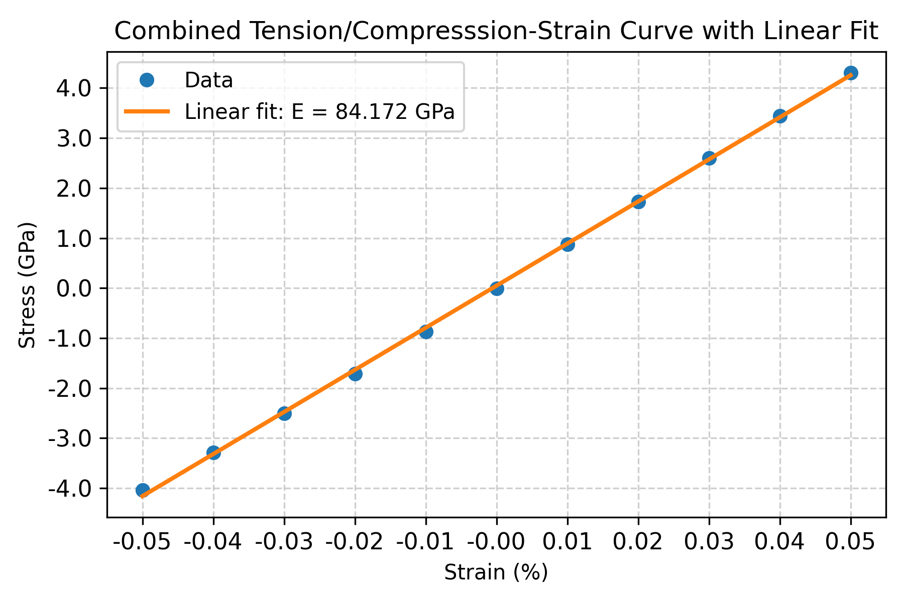
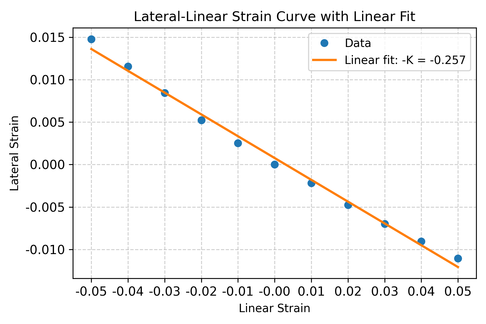

# Young's Modulus and Poisson's Ratio of Germanium Using DFT

## Overview

This project investigates the elastic properties of germanium using Density Functional Theory (DFT) calculations performed with Quantum ESPRESSO. The objective was to determine Young's Modulus and Poisson's Ratio by applying uniaxial strain to a relaxed germanium crystal structure and analyzing the resulting stress-strain and lateral strain responses.

This project demonstrates a computational materials workflow involving structural relaxation, strain-based simulations, elastic property extraction, scientific data analysis, and visualization using Python.

---

## Objectives

- Obtain a fully relaxed germanium crystal structure using DFT.
- Apply tensile and compressive strain to the relaxed structure.
- Calculate stress as a function of applied strain.
- Determine Young's Modulus from the linear elastic stress-strain relationship.
- Determine Poisson's Ratio from the relationship between linear and lateral strain.
- Compare computational results with literature values.

---

## Software and Tools

- Quantum ESPRESSO
- Python
- NumPy
- SciPy
- Pandas
- Matplotlib
- Linux
- Slurm Workload Manager

---

## Computational Workflow

### 1.  Variable-Cell Relaxation

The variable-cell relaxation (vc-relax) was re-used from the bulk modulus workflow.

### 2. Strain Calculations

The relaxed structure was subjected to a series of tensile and compressive strains ranging from -5% to +5%.

Separate Quantum ESPRESSO calculations were performed for each strained structure to obtain the resulting stresses and lattice responses.

### 3. Young's Modulus Analysis

Stress-strain data were extracted from the DFT calculations and analyzed within the linear elastic regime.

A linear regression was performed on the stress-strain relationship, and the slope of the fitted line was used to determine Young's Modulus.

### 4. Poisson's Ratio Analysis

The relationship between linear strain and lateral strain was analyzed using linear regression.

Poisson's Ratio was determined from the negative slope of the lateral strain versus applied (linear) strain relationship.

### 5. Visualization

Python scripts were used to generate publication-style figures and perform statistical analysis of the fitted results.

---

## Repository Structure

```
youngs-modulus-ge-dft/
├── README.md
├── .gitignore
├── environment.yml
│
├── data/
│   ├── combined_poissons_data.csv
│   ├── combined_youngs_data.csv
│   ├── poissons_compression_data.csv
│   ├── poissons_tension_data.csv
│   ├── youngs_compression_data.csv
│   └── youngs_tension_data.csv
│
├── figures/
│   ├── poissons_ratio_analysis.png
│   ├── poissons_ratio_combined_fit.png
│   ├── poissons_ratio_compression_fit.png
│   ├── poissons_ratio_tension_fit.png
│   ├── youngs_modulus_analysis.png
│   ├── youngs_modulus_combined_fit.png
│   ├── youngs_modulus_compression_fit.png
│   └── youngs_modulus_tension_fit.png
│
├── hpc/
│   └── submit_strain.sh
│
├── pseudos/
│    └── ge_pbe_v1.4.uspp.F.UPF
│
├── qe-inputs/
│    ├── vc-relax/
│    └── strain/
│
├── scripts/
│   ├── poissons_ratio_analysis.py
│   ├── poissons_ratio_combined_fit.py
│   ├── poissons_ratio_compression_fit.py
│   ├── poissons_ratio_tension_fit.py
│   ├── youngs_modulus_analysis.py
│   ├── youngs_modulus_combined_fit.py
│   ├── youngs_modulus_compression_fit.py
│   └── youngs_modulus_tension_fit.py
│
└── report/
    └── Ge_YoungsMod_PoissonsRatio_Report.pdf
```

---

## Key Results

|      Property      |    Value   |
|--------------------|------------|
| Young's Modulus    |     84 GPa |
| Poisson's Ratio    |       0.26 |

---

## Figures

### Young's Modulus

The figure below shows the stress-strain relationship used to determine Young's Modulus from the linear elastic response of germanium.



### Poisson's Ratio

The figure below shows the stress-strain relationship between linear strain and lateral strain used to determine Poisson's Ratio.



---

## Skills Demonstrated

- Density Functional Theory (DFT)
- Quantum ESPRESSO
- Elastic Property Calculations
- Stress-Strain Analysis
- Young's Modulus Determination
- Poisson's Ratio Determination
- Computational Materials Science
- Scientific Programming with Python
- Data Analysis and Linear Regression
- Scientific Visualization
- Linux and HPC Workflows
- Slurm Job Scheduling

---

## Computational Environment

Calculations were performed on a Linux-based high-performance computing cluster using the Slurm workload manager.

---

## Future Work

Potential extensions include:

- Calculation of additional elastic constants
- Direction-dependent elastic property analysis
- Automated Quantum ESPRESSO output parsing
- Comparison with experimental and computational literature values
- Extension to other semiconductor materials

---

## References

- Quantum ESPRESSO Documentation
- Materials Project Database
- Literature values for germanium elastic properties